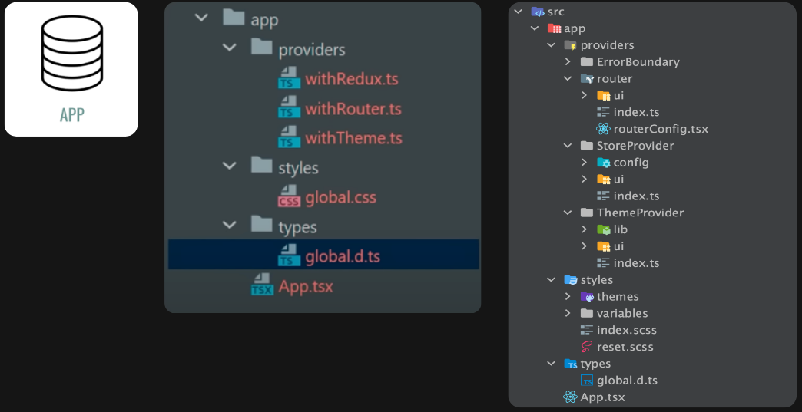

## App

App — это самый верхний, инициализирующий слой. Он содержит корневой компонент, глобальные типы, стили, стейт и оборачивает приложение в провайдеры и контексты — то, что присуще проекту в общем.

