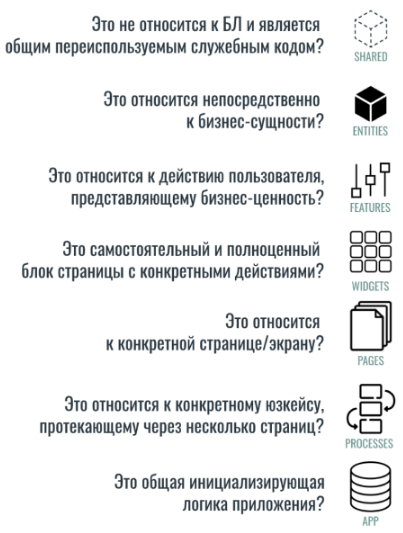

### Processes

Processes — опциональный слой, который используется крайне редко. Он нужен, если бизнес-логика предполагает использование несколько страниц в одном процессе.

Это может быть аутентификация пользователя по телефону. На одной странице человек вводит номер телефона и пароль, на другой — подтверждает номер, на третьей — вводит капчу.

### Как понять, в какой слой поместить код

Не всегда бывает понятно, к какому слою отнести ту или иную сущность. А сделать это нужно сразу — до того, как начнёшь писать код. На такой случай в документации есть список вопросов, который помогает верно распределить сущности:

Также в документации есть таблица импорта: какие слои можно импортировать в каждый из остальных слоев. Например, элементы Shared можно использовать на любом другом слое, но в него ничего нельзя добавить. Слой App, наоборот, способен принимать в себя все другие слои, но никуда не импортируется

### Почему FSD лучше обычного способа организации кода

Слои в Featured-sliced design группируются так, чтобы сделать поток данных в приложении линейным и однонаправленным. Это позволяет избежать неявных связей между модулями.

Можно понять, как это работает, если сравнить структуру кода в стандартном варианте и в варианте FSD.

... TODO

