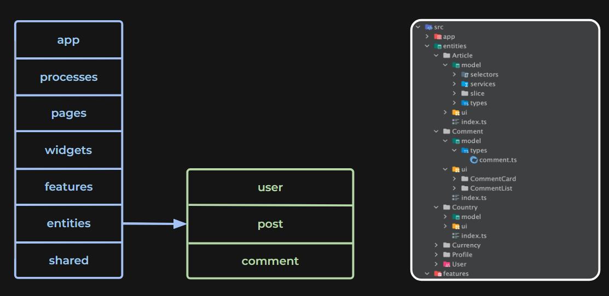
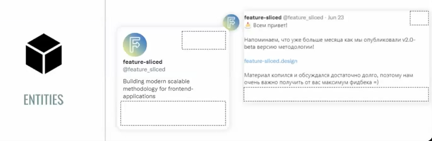

# **Entities**

Первое, что вам следует понять. 

**Бизнес-сущности** — это объекты реального мира, которые предоставляет вам приложение. Представьте их как важные элементы, без которых ваше приложение не сможет функционировать. Они содержат данные, которые имеют значение для конкретной задачи, которую решает ваше приложение.

Проще говоря, **бизнес-сущности** — это важные элементы, с которыми вы взаимодействуете в реальной жизни, и которые ваше приложение должно обрабатывать, отображать или изменять.

**Entities** — это компоненты, которые представляют собой бизнес-сущности и являются «кирпичиками» для построения бизнес-логики приложения. Каждый компонент в этом слое отвечает за отдельную бизнес-сущность и не должен содержать абстрактную логику, а также фокусируется на работе с данными и их отображении.

---

### **Зачем нужен слой Entities?**

Этот слой организует компоненты, связанные с конкретными бизнес-сущностями, что позволяет:
- Четко структурировать бизнес-логику.
- Легко управлять данными, связанными с конкретной сущностью.
- Разграничивать абстрактные и бизнес-ориентированные компоненты.

---

---

### **Примеры использования:**
- В приложении социальной сети сущностями будут: пользователь, пост, комментарий.
- В интернет-магазине сущностями могут быть: товар, категория, заказ.

---

### **Entities — Бизнес-ориентированные компоненты**
Каждый компонент в слое **Entities** напрямую связан с конкретной бизнес-сущностью и ее обработкой. Это могут быть:
- **Пользователь**: отображение данных профиля, подписки, аватар.
- **Пост**: текстовые сообщения, изображения, дата публикации.
- **Комментарий**: ответ на пост, вложенность комментариев.

---

---

### **Правила использования:**
- Все компоненты в **Entities** работают с конкретной бизнес-сущностью.
- Логика, которая зависит от конкретных данных (например, проверка пользователя или создание поста), должна находиться именно в этом слое.
