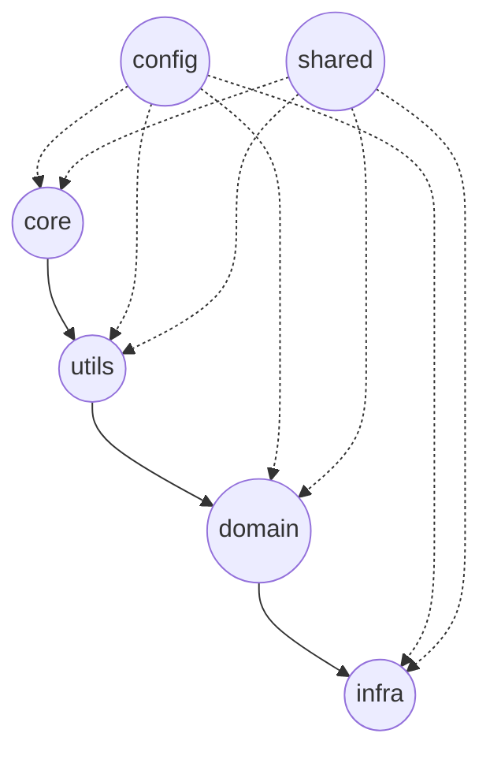

# 📚 lib/ Layered Architecture Documentation

> This document describes the structure, rules, and best practices for working with the `lib/` folder.
> It is intended to **standardize development**, **prevent cyclic dependencies**, and **enable scalable growth**.

---

## 📐 Project Structure

---

## 🏗 Layer Responsibilities

| Layer | Responsibility | Allowed Dependencies |
|:-----|:----------------|:----------------------|
| **core/** | Basic, low-level primitives and pure logic | None |
| **utils/** | Helper functions built on top of core | core |
| **domain/** | Business entities, domain logic | utils, core |
| **infra/** | Environment-related services (OS, storage, cache) | domain, utils, core |
| **config/** | Static project configurations | Referenced only |
| **shared/** | Common constants and types | Referenced only |

... (сокращено ради компактности)
