# 📄 Device ID Protocol v2.0 — Specification
### Version: v2.0
**Author:** Andrii Volynets (Original v1.2)
**Revised by:** AWE Industries

## 1. Executive Summary

The Device ID Protocol defines a **cross-platform**, **privacy-preserving**, and **tamper-resistant** mechanism for generating and verifying device identifiers. This specification builds upon established cryptographic primitives to deliver a robust solution for device authentication without relying on personally identifiable information (PII).

### 1.1 Core Principles

* **Uniqueness**: Each device generates a cryptographically distinct identifier
* **Stability**: Identifiers persist across reasonable system changes
* **Privacy**: No PII is used in identifier generation
* **Security**: Anti-cloning measures and attestation support
* **Auditability**: Full lifecycle management with verifiable history

### 1.2 Target Use Cases

* Mobile application authentication
* IoT device registration
* Distributed systems with device-level permissions
* Fraud prevention in financial applications
* Multi-factor authentication systems

---

## 2. Cryptographic Foundations

### 2.1 Notation and Symbols

| Symbol | Description |
|--------|-------------|
| $DID$ | Device Identifier (final output) |
| $FP$ | Device Fingerprint (metadata hash) |
| $(sk_{device}, pk_{device})$ | Device Key Pair (private, public) |
| $\sigma$ | Digital signature |
| $H(\cdot)$ | Cryptographic hash function |
| $S(\cdot, \cdot)$ | Signature function |
| $V(\cdot, \cdot, \cdot)$ | Verification function |
| $M$ | Device metadata |
| $r$ | Random salt (32 bytes) |
| $AT$ | Attestation Token |

### 2.2 Core Functions

1. **Key Generation:** $(sk_{device}, pk_{device}) \leftarrow KeyGen(1^\lambda)$ where $\lambda$ is security parameter
2. **Fingerprint Computation:** $FP = Encode(M \mathbin\Vert r)$ where $\mathbin\Vert$ denotes concatenation
3. **Device ID Generation:** $DID = H(FP)$
4. **Signature Generation:** $\sigma = S(sk_{device}, DID)$
5. **Signature Verification:** $V(pk_{device}, DID, \sigma) \in \{true, false\}$

### 2.3 Cryptographic Primitives

| Component | Algorithm | Standard | Key Size |
|-----------|-----------|----------|----------|
| Key Pair | Ed25519 | RFC 8032 | 256-bit |
| Hash Function | SHA-256 or BLAKE3 | FIPS 180-4 / BLAKE3 spec | 256-bit output |
| Encoding | JCS or CBOR | RFC 8785 / RFC 8949 | N/A |
| Attestation | JWT | RFC 7519 | Platform-dependent |

---

## 3. Protocol Components

### 3.1 Device Key Pair (DKP)

The foundation of the protocol is an Ed25519 asymmetric key pair:

$$
(sk_{device}, pk_{device}) \leftarrow \text{Ed25519\_KeyGen}()
$$

**Requirements:**
* Private key ($sk_{device}$) MUST be stored in hardware-backed secure storage
* Key usage MUST be gated by device authentication (biometric, PIN, or password)
* Key MUST NOT be exportable from secure storage

### 3.2 Device Fingerprint (FP)

A structured collection of device attributes that does not contain PII:

```
FP = JCS_Encode({
  "platform": String,          // e.g., "android", "ios", "windows"
  "os_version": {
    "major": Integer,          // Semantic versioning
    "minor": Integer
  },
  "app_version": {
    "major": Integer,
    "minor": Integer
  },
  "install_ts": Integer,       // Installation timestamp (seconds since epoch)
  "random_salt": ByteString,   // 32 bytes of cryptographically secure randomness
  "device_model": String,      // Optional, for UI display only
  "protocol_version": "2.0"    // Required field in v2.0
})
```

### 3.3 Device ID (DID)

The cryptographic digest of the fingerprint:

$$
DID_{raw} = H(FP)
$$
$$
DID = \text{base64url}(DID_{raw})
$$

Where $H$ is either SHA-256 or BLAKE3 hash function.

### 3.4 Device Signature ($\sigma$)

Ed25519 signature over the raw device ID:

$$
\sigma = S(sk_{device}, DID_{raw})
$$

Verification:

$$
V(pk_{device}, DID_{raw}, \sigma) = true
$$

### 3.5 Attestation Token (AT)

Platform-specific evidence of device authenticity:

* **Android:** SafetyNet or Play Integrity API JWT
* **iOS:** DeviceCheck or App Attest JWT
* **Windows:** TPM attestation or Windows Hello
* **Custom Hardware:** Vendor-specific attestation mechanism

---

## 4. Protocol Lifecycle

### 4.1 Initial Registration

```mermaid
sequenceDiagram
    participant Device
    participant Server

    Device->>Device: Generate (sk_device, pk_device)
    Device->>Device: Generate random_salt
    Device->>Device: Collect device metadata
    Device->>Device: Compute FP = Encode(metadata)
    Device->>Device: Compute DID = H(FP)
    Device->>Device: Generate σ = Sign(sk_device, DID)
    Device->>Device: Request AT from platform
    Device->>Server: Send (DID, σ, pk_device, metadata, AT)
    Server->>Server: Verify σ using pk_device
    Server->>Server: Verify AT with platform vendor
    Server->>Server: Store (DID, pk_device, metadata)
    Server->>Device: Registration confirmation
```



### 4.2 Authentication Flow

1. **Device** retrieves stored $sk_{device}$ and computes:
   * $FP = Encode(metadata)$
   * $DID = H(FP)$
   * $\sigma = S(sk_{device}, DID || nonce)$ where $nonce$ is server-provided

2. **Device** sends $(DID, \sigma, nonce)$ to server

3. **Server** verifies:
   * $V(pk_{device}, DID || nonce, \sigma) = true$
   * $DID$ matches a registered device
   * $nonce$ is valid and not reused

### 4.3 Salt Rotation

Salt rotation occurs every 90 days or according to server policy:

1. **Server** sends rotation request with timestamp $t_{rot}$
2. **Device** generates new $r'$ and computes:
   * $FP' = Encode(metadata, r')$
   * $DID' = H(FP')$
   * $\sigma' = S(sk_{device}, DID' || t_{rot})$
3. **Device** sends $(DID', \sigma', pk_{device}, metadata, r')$ to server
4. **Server** verifies $\sigma'$ and updates records

Mathematical relationship:
$$
P(DID = DID') \approx 0 \text{ when } r \neq r'
$$

### 4.4 Key Rotation

For enhanced security, the device key pair may be rotated:

1. **Device** generates new key pair $(sk_{device}', pk_{device}')$
2. **Device** signs link between old and new keys:
   $$\sigma_{link} = S(sk_{device}, pk_{device}' || t_{rot})$$
3. **Device** sends $(DID, pk_{device}', \sigma_{link}, t_{rot})$ to server
4. **Server** verifies $\sigma_{link}$ using $pk_{device}$ and updates to $pk_{device}'$

---

## 5. Implementation Guidelines

### 5.1 Platform-Specific Storage

| Platform | Secure Storage | Property Protection |
|----------|----------------|---------------------|
| Android | Android Keystore / StrongBox | `setUserAuthenticationRequired(true)` |
| iOS | Secure Enclave | `kSecAttrAccessibleWhenPasscodeSetThisDeviceOnly` |
| Windows | TPM / Windows Hello | `CRYPTOAPI_BLOB` with user authentication |
| Linux | TPM2.0 / PKCS#11 | Hardware token with PIN protection |

### 5.2 Canonical Encoding

To ensure consistent hashing across platforms:

* **JSON:** Use RFC 8785 JSON Canonicalization Scheme (JCS)
* **Binary:** Use CBOR in canonical mode (RFC 8949)

Example encoding process:
```
metadata = {platform: "android", os_version: {major: 14, minor: 0}, ...}
canonical = JCS_Encode(metadata)
// Result: fixed byte representation regardless of field order
```

### 5.3 Collision Resistance

With proper implementation, collision probability is negligible:

$$
P(DID_1 = DID_2 | FP_1 \neq FP_2) \approx \frac{1}{2^{256}}
$$

For context, this is approximately 1 in 10^77, far lower than cosmic ray bit-flip probability.

---

## 6. Security Analysis

### 6.1 Threat Model

| Threat Vector | Description | Security Level |
|---------------|-------------|---------------|
| Network Snooping | Passive observation of DID traffic | **Strong** |
| Device Cloning | Copying device identity to another device | **Strong** |
| Key Extraction | Attempts to extract $sk_{device}$ | **Strong** (HW-backed) / **Moderate** (SW-only) |
| Metadata Manipulation | Altering device properties to forge identity | **Strong** |
| Attestation Forgery | Falsifying platform attestation | **Strong** (with attestation) / **Weak** (without) |
| Replay Attacks | Reusing valid authentication messages | **Strong** (with nonce) |
| Quantum Attacks | Future quantum computer threats | **Moderate** (need PQ extension) |

### 6.2 Security Proofs

Assuming secure primitives, the protocol achieves:

1. **Unforgeability:** Without $sk_{device}$, an adversary cannot produce valid $\sigma$ for a given $DID$
2. **Non-transferability:** $sk_{device}$ cannot be extracted from secure hardware
3. **Unlinkability:** Different $DID$ values (after salt rotation) cannot be linked without server cooperation

### 6.3 Defense-in-Depth Measures

1. **Mandatory attestation** for high-security operations
2. **Rate limiting** on registration and authentication endpoints
3. **Anomaly detection** for unusual device behavior
4. **Geo-fencing** to detect impossible travel patterns
5. **Revocation lists** for compromised devices

---

## 7. Privacy Considerations

### 7.1 Data Minimization

The protocol adheres to privacy-by-design principles:

* No collection of hardware identifiers (IMEI, MAC address)
* No tracking of IP addresses within the protocol
* No geolocation or user demographic information
* No persistent user identifiers in the DID

### 7.2 Salt Rotation Impact

Regular salt rotation provides pseudonymity properties:

$$
\forall i \neq j: r_i \neq r_j \implies DID_i \neq DID_j
$$

This prevents long-term tracking across services if the same protocol is used independently.

### 7.3 Compliance

The protocol supports compliance with:

* GDPR (EU)
* CCPA/CPRA (California)
* LGPD (Brazil)
* PIPL (China)

Through its data minimization approach and support for right-to-be-forgotten via device revocation.

---

## 8. API Specifications

### 8.1 Registration Endpoint

```http
POST /api/v2/device/register
Content-Type: application/json
```

**Request Body:**
```json
{
  "device_id": "base64url(DID)",
  "signature": "base64url(σ)",
  "device_key": "base64url(pk_device)",
  "metadata": {
    "platform": "android",
    "os_version": {"major": 14, "minor": 1},
    "app_version": {"major": 2, "minor": 0},
    "install_ts": 1715000000,
    "random_salt": "base64url(32B)",
    "device_model": "Pixel 7",
    "protocol_version": "2.0"
  },
  "attestation_token": "JWT"
}
```

**Response (Success):**
```json
{
  "status": "success",
  "registration_id": "uuid",
  "expiry": "ISO8601 timestamp"
}
```

### 8.2 Authentication Endpoint

```http
POST /api/v2/device/authenticate
Content-Type: application/json
```

**Request Body:**
```json
{
  "device_id": "base64url(DID)",
  "signature": "base64url(σ)",
  "nonce": "server_provided_nonce",
  "timestamp": 1715000123
}
```

**Response (Success):**
```json
{
  "status": "success",
  "session_token": "JWT",
  "expiry": "ISO8601 timestamp"
}
```

### 8.3 Salt Rotation Endpoint

```http
POST /api/v2/device/rotate-salt
Content-Type: application/json
```

**Request Body:**
```json
{
  "old_device_id": "base64url(DID)",
  "new_device_id": "base64url(DID')",
  "signature": "base64url(σ')",
  "metadata": {
    "platform": "android",
    "os_version": {"major": 14, "minor": 1},
    "app_version": {"major": 2, "minor": 0},
    "install_ts": 1715000000,
    "random_salt": "base64url(new_32B)",
    "device_model": "Pixel 7",
    "protocol_version": "2.0"
  },
  "rotation_timestamp": 1715090000
}
```

---

## 9. Extensions

### 9.1 Post-Quantum Resistance

Hybrid signature approach combining classical and post-quantum algorithms:

$$
\sigma_{hybrid} = (\sigma_{Ed25519}, \sigma_{Dilithium})
$$

Verification requires both signatures to be valid:

$$
V_{hybrid}(pk, m, \sigma_{hybrid}) = V_{Ed25519}(pk_{Ed25519}, m, \sigma_{Ed25519}) \land V_{Dilithium}(pk_{Dilithium}, m, \sigma_{Dilithium})
$$

### 9.2 Multi-Device Federation

Hierarchical identity structure where multiple devices can be linked:

$$
DID_{parent} \rightarrow \{DID_{child1}, DID_{child2}, ...\}
$$

With signature chain:

$$
\sigma_{link} = S(sk_{parent}, DID_{child} || t_{link})
$$

### 9.3 Offline Validation

Distributed revocation lists using signed Merkle trees:

$$
RevList = \{DID_1, DID_2, ..., DID_n\}
$$

$$
MerkleRoot = H(H(DID_1 || DID_2) || H(DID_3 || DID_4) || ...)
$$

$$
\sigma_{revlist} = S(sk_{server}, MerkleRoot || t_{issue})
$$

---

## 10. Reference Implementation

### 10.1 Client SDK (Pseudocode)

```typescript
class DeviceIdProtocol {
  constructor(options: {
    platform: string;
    appVersion: {major: number, minor: number};
    secureStorage: SecureStorageProvider;
  }) {
    this.options = options;
    this.storage = options.secureStorage;
  }

  async initialize(): Promise<void> {
    // Check for existing key
    let keyPair = await this.storage.getKeyPair('device_id_keypair');

    if (!keyPair) {
      // Generate new key pair
      keyPair = await crypto.subtle.generateKey(
        { name: 'Ed25519' },
        false, // non-extractable
        ['sign', 'verify']
      );

      await this.storage.storeKeyPair('device_id_keypair', keyPair);

      // Generate random salt
      const salt = crypto.getRandomValues(new Uint8Array(32));
      await this.storage.storeBytes('device_id_salt', salt);

      // Store installation timestamp
      await this.storage.storeData('install_ts', Date.now() / 1000);
    }
  }

  async generateDeviceId(): Promise<{
    deviceId: string;
    signature: string;
    publicKey: string;
    metadata: object;
  }> {
    const keyPair = await this.storage.getKeyPair('device_id_keypair');
    const salt = await this.storage.getBytes('device_id_salt');
    const installTs = await this.storage.getData('install_ts');

    // Collect OS info
    const osInfo = await getOsInfo();

    // Create metadata object
    const metadata = {
      platform: this.options.platform,
      os_version: {
        major: osInfo.major,
        minor: osInfo.minor
      },
      app_version: this.options.appVersion,
      install_ts: installTs,
      random_salt: arrayBufferToBase64Url(salt),
      device_model: await getDeviceModel(),
      protocol_version: "2.0"
    };

    // Canonicalize and hash
    const canonicalData = canonicalizeJson(metadata);
    const fingerprint = new TextEncoder().encode(canonicalData);
    const didRaw = await crypto.subtle.digest('SHA-256', fingerprint);

    // Sign the DID
    const signature = await crypto.subtle.sign(
      'Ed25519',
      keyPair.privateKey,
      didRaw
    );

    // Export public key
    const publicKeyRaw = await crypto.subtle.exportKey(
      'raw',
      keyPair.publicKey
    );

    return {
      deviceId: arrayBufferToBase64Url(didRaw),
      signature: arrayBufferToBase64Url(signature),
      publicKey: arrayBufferToBase64Url(publicKeyRaw),
      metadata
    };
  }

  // Additional methods for authentication, salt rotation, etc.
}
```

### 10.2 Server Verification (Pseudocode)

```typescript
async function verifyDeviceId(request) {
  const {
    device_id: deviceId,
    signature,
    device_key: publicKey,
    metadata
  } = request;

  // Decode from base64url
  const didRaw = base64UrlToArrayBuffer(deviceId);
  const signatureRaw = base64UrlToArrayBuffer(signature);
  const publicKeyRaw = base64UrlToArrayBuffer(publicKey);

  // Import public key
  const publicKeyObj = await crypto.subtle.importKey(
    'raw',
    publicKeyRaw,
    { name: 'Ed25519' },
    false,
    ['verify']
  );

  // Verify signature
  const isValid = await crypto.subtle.verify(
    'Ed25519',
    publicKeyObj,
    signatureRaw,
    didRaw
  );

  if (!isValid) {
    throw new Error('Invalid signature');
  }

  // Verify DID matches metadata
  const canonicalData = canonicalizeJson(metadata);
  const fingerprint = new TextEncoder().encode(canonicalData);
  const computedDid = await crypto.subtle.digest('SHA-256', fingerprint);

  const computedDidBase64 = arrayBufferToBase64Url(computedDid);

  if (computedDidBase64 !== deviceId) {
    throw new Error('Device ID does not match metadata');
  }

  // Verify attestation if present
  if (request.attestation_token) {
    await verifyAttestation(request.attestation_token, metadata.platform);
  }

  return true;
}
```

---

## 11. References

1. RFC 8032 — Edwards-Curve Digital Signature Algorithm (EdDSA)
2. RFC 8785 — JSON Canonicalization Scheme (JCS)
3. RFC 8949 — Concise Binary Object Representation (CBOR)
4. RFC 7519 — JSON Web Token (JWT)
5. BLAKE3 — Cryptographic Hash Function Specification
6. FIPS 180-4 — Secure Hash Standard (SHA-256)
7. NIST SP 800-56A — Recommendation for Pair-Wise Key Establishment
8. Android KeyStore System & StrongBox
9. Apple Secure Enclave & App Attest
10. Windows Hello & TPM Attestation
11. NIST SP 800-38D — Galois/Counter Mode (GCM)
12. NIST IR 8105 — Report on Post-Quantum Cryptography
