# 📄 Device ID Protocol v3.1 — Enhanced Specification

## Document Information
- **Version**: 3.1
- **Original Author**: Andrii Volynets (v1.0)
- **Previous Revisions**:
  - AWE Industries (v2.0)
  - Anonymous Contributor (v3.0)
- **Current Revision**: May 9, 2025

## 1. Executive Summary

The Device ID Protocol provides a **cross-platform**, **privacy-preserving**, and **tamper-resistant** mechanism for generating and verifying device identifiers. This specification leverages established cryptographic primitives to deliver a robust solution for device authentication without relying on personally identifiable information (PII).

### 1.1 Core Principles

| Principle | Description |
|-----------|-------------|
| **Uniqueness** | Each conforming device produces a cryptographically distinct identifier |
| **Stability** | Identifiers remain consistent despite routine system updates |
| **Privacy** | No personally identifiable information (PII) is collected or transmitted |
| **Security** | Strong protections against impersonation and device cloning |
| **Auditability** | Complete lifecycle management with comprehensive event logs |
| **Recovery** | Defined processes for key recovery and identifier restoration |
| **Future-Proof** | Designed with post-quantum migration capabilities |

### 1.2 Target Use Cases

- **Authentication and access control**
  - Secure authentication in mobile applications
  - Support for multi-factor authentication (MFA)
  - Device authentication when accessing corporate systems
  - Enhanced identity verification for high-risk operations
- **IoT and distributed systems**
  - Registration and identification of devices in IoT networks
  - Authentication of devices in distributed infrastructures
  - Secure device registration in multi-tenant architectures
- **Financial security and fraud prevention**
  - Detection and prevention of fraudulent activities in fintech environments
  - Protection of payment transactions and e-commerce operations
  - Issuance of temporary or enhanced access to high-risk functions
- **Privacy-preserving analytics**
  - Identification of devices without revealing user identity
  - Collection of statistical data while preserving device confidentiality

## 2. Protocol Overview

### 2.1 Architectural Components

The Device ID Protocol consists of four primary components:

1. **Device Key Pair (DKP)**: An Ed25519 asymmetric key pair stored in secure hardware
2. **Device Fingerprint (FP)**: A structured collection of non-PII device attributes
3. **Device ID (DID)**: A cryptographic digest of the device fingerprint
4. **Attestation Token (AT)**: Platform-specific evidence of device authenticity

### 2.2 Workflow Summary


## 3. Cryptographic Foundations

### 3.1 Notation and Symbols

For cryptographic operations, we use the following notation:

- $DID$: Device Identifier (final output)
- $FP$: Device Fingerprint (metadata hash)
- $(sk_{device}, pk_{device})$: Device Key Pair (private, public)
- $\sigma$: Digital signature
- $H(\cdot)$: Cryptographic hash function
- $S(\cdot, \cdot)$: Signature function
- $V(\cdot, \cdot, \cdot)$: Verification function
- $r$: Random salt (32 bytes)
- $AT$: Attestation Token
- $C$: Context identifier
- $DID_C$: Context-derived Device Identifier
- $E_{hybrid}(m)$: Hybrid encryption of message $m$
- $KDF(k, ctx, len)$: Key derivation function with key $k$, context $ctx$, and output length $len$

### 3.2 Core Functions

1. **Key Generation:** $(sk_{device}, pk_{device}) \leftarrow KeyGen(1^\lambda)$ where $\lambda$ is security parameter
2. **Fingerprint Computation:** $FP = Encode(M \mathbin\Vert r)$ where $\mathbin\Vert$ denotes concatenation
3. **Device ID Generation:** $DID = H(FP)$
4. **Signature Generation:** $\sigma = S(sk_{device}, DID)$
5. **Signature Verification:** $V(pk_{device}, DID, \sigma) \in \{true, false\}$
6. **Error Handling:** $ErrorCode = ProcessError(ErrorCondition, ContextData)$

### 3.3 Cryptographic Primitives

| Component | Algorithm | Standard | Security Level |
|-----------|-----------|----------|---------------|
| Key Generation | Ed25519 | RFC 8032 | 128-bit |
| Hash Function | BLAKE3 | BLAKE3 Spec | 256-bit |
| Alternative Hash | SHA-256 | FIPS 180-4 | 128-bit |
| Data Encoding | JCS | RFC 8785 | N/A |
| Alternative Encoding | CBOR | RFC 8949 | N/A |
| Key Derivation | HKDF-SHA256 | RFC 5869 | 256-bit |
| Key Derivation (Alt) | HKDF-BLAKE3 | BLAKE3 Spec | 256-bit |
| Post-Quantum Option | Dilithium | NIST PQC | 128-bit quantum |
| Post-Quantum KEM | Kyber | NIST PQC | 128-bit quantum |
| Post-Quantum Hash | SLH-DSA | NIST PQC | 128-bit quantum |

## 4. Protocol Components

### 4.1 Device Key Pair (DKP)

The foundation of the protocol is an Ed25519 asymmetric key pair:

$$
(sk_{device}, pk_{device}) \leftarrow \text{Ed25519\_KeyGen}()
$$

**Security Requirements:**
- Private key material **MUST** be stored in hardware-backed secure storage:
  - Android: Android Keystore with StrongBox when available
  - iOS: Secure Enclave
  - Windows: TPM-backed Windows Hello
  - Linux: TPM 2.0 or HSM
- Key usage **MUST** be gated by device authentication (biometric, PIN, or password)
- Key **MUST NOT** be exportable from secure storage
- Implementations **MUST** verify key generation completion successfully before proceeding

### 4.2 Device Fingerprint (FP)

A structured collection of device attributes that does not contain PII:

```json
{
  "platform": "String",          // e.g., "android", "ios", "windows"
  "os_version": {
    "major": "Integer",          // Semantic versioning
    "minor": "Integer"
  },
  "app_version": {
    "major": "Integer",
    "minor": "Integer"
  },
  "install_ts": "Integer",       // Installation timestamp (seconds since epoch)
  "random_salt": "ByteString",   // 32 bytes of cryptographically secure randomness
  "device_model": "String",      // Optional, for UI display only
  "protocol_version": "3.1",     // Required field, updated for current version
  "security_level": "String",    // e.g., "strongbox", "tee", "software"
  "tpm_manufacturer": "String"   // Optional, for supply chain verification
}
```

### 4.3 Device ID (DID)

The cryptographic digest of the fingerprint:

$$
DID_{raw} = H(FP)
$$
$$
DID = \text{base64url}(DID_{raw})
$$

Where $H$ is either SHA-256 or BLAKE3 hash function.

### 4.4 Device Signature ($\sigma$)

Ed25519 signature over the raw device ID:

$$
\sigma = S(sk_{device}, DID_{raw})
$$

Verification:

$$
V(pk_{device}, DID_{raw}, \sigma) = true
$$

### 4.5 Attestation Token (AT)

Platform-specific evidence of device authenticity:

* **Android:** SafetyNet or Play Integrity API JWT
* **iOS:** DeviceCheck or App Attest JWT
* **Windows:** TPM attestation or Windows Hello
* **Custom Hardware:** Vendor-specific attestation mechanism

**Attestation Verification Requirements:**
- Implementations **MUST** validate attestation-specific signatures
- Attestation verification **MUST** use constant-time comparison
- Attestation failures **MUST** generate detailed error codes

## 5. Protocol Lifecycle

### 5.1 Initial Registration

```mermaid
sequenceDiagram
    participant Device
    participant Server

    Device->>Device: Generate (sk_device, pk_device)
    Device->>Device: Generate random_salt
    Device->>Device: Collect device metadata
    Device->>Device: Compute FP = Encode(metadata)
    Device->>Device: Compute DID = H(FP)
    Device->>Device: Generate σ = Sign(sk_device, DID)
    Device->>Device: Request AT from platform
    Device->>Server: Send (DID, σ, pk_device, metadata, AT)
    Server->>Server: Verify σ using pk_device
    Server->>Server: Verify AT with platform vendor
    Server->>Server: Store (DID, pk_device, metadata)
    Server->>Device: Registration confirmation

    alt Registration Failure
        Server->>Device: Error code and recovery steps
        Device->>Device: Apply recovery strategy
        Device->>Server: Retry with revised parameters
    end
```



### 5.2 Authentication Flow

1. **Device** retrieves stored $sk_{device}$ and computes:
   * $FP = Encode(metadata)$
   * $DID = H(FP)$
   * $\sigma = S(sk_{device}, DID || nonce)$ where $nonce$ is server-provided

2. **Device** sends $(DID, \sigma, nonce)$ to server

3. **Server** verifies:
   * $V(pk_{device}, DID || nonce, \sigma) = true$
   * $DID$ matches a registered device
   * $nonce$ is valid and not reused

### 5.3 Salt Rotation

Salt rotation occurs every 90 days or according to server policy:

1. **Server** sends rotation request with timestamp $t_{rot}$
2. **Device** generates new $r'$ and computes:
   * $FP' = Encode(metadata, r')$
   * $DID' = H(FP')$
   * $\sigma' = S(sk_{device}, DID' || t_{rot})$
3. **Device** sends $(DID', \sigma', pk_{device}, metadata, r')$ to server
4. **Server** verifies $\sigma'$ and updates records

Mathematical relationship:
$$
P(DID = DID') \approx 0 \text{ when } r \neq r'
$$

**Recommended Rotation Triggers:**
- Time-based: Every 90 days (default)
- Event-based: After OS updates, app reinstallation, or security incidents
- Risk-based: More frequent rotation for high-risk devices/users

### 5.4 Key Rotation

For enhanced security, the device key pair may be rotated:

1. **Device** generates new key pair $(sk_{device}', pk_{device}')$
2. **Device** signs link between old and new keys:
   $$\sigma_{link} = S(sk_{device}, pk_{device}' || t_{rot})$$
3. **Device** sends $(DID, pk_{device}', \sigma_{link}, t_{rot})$ to server
4. **Server** verifies $\sigma_{link}$ using $pk_{device}$ and updates to $pk_{device}'$

**Recommended Key Rotation Frequency:**
- Every 180-365 days for standard security applications
- Every 90 days for high-security applications
- Immediately upon suspected compromise

### 5.5 Key Compromise Recovery

In the event of suspected key compromise:

1. **Device** or **Server** initiates emergency revocation:
   $$\sigma_{revoke} = S(sk_{authority}, DID || t_{revoke} || \text{"REVOKE"})$$
2. **Server** adds $DID$ to revocation list
3. **Device** performs device attestation challenge
4. If attestation succeeds, device re-registers with new key pair
5. All recovery actions are logged with audit trail

## 6. Implementation Guidelines

### 6.1 Platform-Specific Storage

| Platform | Secure Storage | Property Protection | Error Handling |
|----------|----------------|---------------------|---------------|
| Android | Android Keystore / StrongBox | `setUserAuthenticationRequired(true)` | KeyPermanentlyInvalidatedException |
| iOS | Secure Enclave | `kSecAttrAccessibleWhenPasscodeSetThisDeviceOnly` | kSecError codes |
| Windows | TPM / Windows Hello | `CRYPTOAPI_BLOB` with user authentication | HRESULT status codes |
| Linux | TPM2.0 / PKCS#11 | Hardware token with PIN protection | PKCS#11 return codes |

### 6.2 Canonical Encoding

To ensure consistent hashing across platforms:

* **JSON:** Use RFC 8785 JSON Canonicalization Scheme (JCS)
* **Binary:** Use CBOR in canonical mode (RFC 8949)

Example encoding process:
```
metadata = {platform: "android", os_version: {major: 14, minor: 0}, ...}
canonical = JCS_Encode(metadata)
// Result: fixed byte representation regardless of field order
```

### 6.3 Collision Resistance

With proper implementation, collision probability is negligible:

$$
P(DID_1 = DID_2 | FP_1 \neq FP_2) \approx \frac{1}{2^{256}}
$$

For context, this is approximately 1 in 10^77, far lower than cosmic ray bit-flip probability.

### 6.4 Performance Considerations

| Operation | Expected Time (ms) | CPU Usage | Memory (KB) |
|-----------|-------------------|-----------|------------|
| Key Generation | 50-200 | Medium | 5-10 |
| DID Computation | 5-15 | Low | 2-5 |
| Signature Generation | 2-10 | Low | 1-2 |
| Signature Verification | 2-10 | Low | 1-2 |
| PQ Signature Generation | 50-200 | High | 20-50 |
| PQ Signature Verification | 30-100 | Medium | 10-30 |

**Benchmarking Guidelines:**
- Measure all operations on target devices
- Establish baseline performance metrics
- Monitor for performance degradation
- Set performance budgets for client operations

## 7. Security Analysis

### 7.1 Threat Model

| Threat Vector | Description | Security Level | Mitigation |
|---------------|-------------|----------------|------------|
| Network Snooping | Passive observation of DID traffic | **Strong** | All sensitive data encrypted |
| Device Cloning | Copying device identity to another device | **Strong** | Hardware-backed keys + attestation |
| Key Extraction | Attempts to extract $sk_{device}$ | **Strong** (HW-backed) / **Moderate** (SW-only) | Secure element protection |
| Metadata Manipulation | Altering device properties to forge identity | **Strong** | Signed fingerprints |
| Attestation Forgery | Falsifying platform attestation | **Strong** (with attestation) / **Weak** (without) | Vendor attestation verification |
| Replay Attacks | Reusing valid authentication messages | **Strong** (with nonce) | Time-limited nonces |
| Quantum Attacks | Future quantum computer threats | **Strong** (with PQ) / **Moderate** (without) | Hybrid cryptography approach |
| Supply Chain Attacks | Compromised hardware or software components | **Moderate** | TPM manufacturer validation |
| Side-Channel Attacks | Extracting keys via timing/power analysis | **Moderate** | Constant-time implementations |
| Hardware Vulnerabilities | Exploitation of hardware design flaws | **Moderate** | Attestation + regular security updates |
| Root/Jailbreak | Circumvention of OS security | **Moderate** | Root/jailbreak detection |

### 7.2 Security Proofs

Assuming secure primitives, the protocol achieves:

1. **Unforgeability:** Without $sk_{device}$, an adversary cannot produce valid $\sigma$ for a given $DID$
2. **Non-transferability:** $sk_{device}$ cannot be extracted from secure hardware
3. **Unlinkability:** Different $DID$ values (after salt rotation) cannot be linked without server cooperation
4. **Post-Quantum Security:** With hybrid approach, remains secure against quantum attacks

### 7.3 Defense-in-Depth Measures

1. **Mandatory attestation** for high-security operations
2. **Rate limiting** on registration and authentication endpoints
3. **Anomaly detection** for unusual device behavior
4. **Geo-fencing** to detect impossible travel patterns
5. **Revocation lists** for compromised devices
6. **Supply chain validation** for hardware components
7. **Constant-time implementations** for all cryptographic operations

## 8. Privacy Considerations

### 8.1 Data Minimization

The protocol adheres to privacy-by-design principles:

* No collection of hardware identifiers (IMEI, MAC address)
* No tracking of IP addresses within the protocol
* No geolocation or user demographic information
* No persistent user identifiers in the DID

### 8.2 Salt Rotation Impact

Regular salt rotation provides pseudonymity properties:

$$
\forall i \neq j: r_i \neq r_j \implies DID_i \neq DID_j
$$

This prevents long-term tracking across services if the same protocol is used independently.

### 8.3 Compliance

The protocol supports compliance with global privacy regulations:

| Regulation | Region | Key Requirements | Protocol Compliance |
|------------|--------|------------------|---------------------|
| GDPR | EU | Data minimization, Purpose limitation | Strong compliance via minimal data collection |
| CCPA/CPRA | California | Right to delete, Right to opt-out | Supported via device revocation |
| LGPD | Brazil | Consent, Purpose limitation | Aligned with minimal data collection approach |
| PIPL | China | Data localization, Purpose limitation | Compatible with regional implementations |
| Privacy Act | Australia | APP principles compliance | Supports via data minimization |

**Certification Guidelines:**
- ISO/IEC 27001 for information security management
- SOC 2 Type II for service organization controls
- FIPS 140-3 for cryptographic module validation

## 9. API Specifications

### 9.1 Registration Endpoint

```http
POST /api/v3/device/register
Content-Type: application/json
```

**Request Body:**
```json
{
  "device_id": "base64url(DID)",
  "signature": "base64url(σ)",
  "device_key": "base64url(pk_device)",
  "metadata": {
    "platform": "android",
    "os_version": {"major": 14, "minor": 1},
    "app_version": {"major": 2, "minor": 0},
    "install_ts": 1715000000,
    "random_salt": "base64url(32B)",
    "device_model": "Pixel 7",
    "protocol_version": "3.1",
    "security_level": "strongbox",
    "tpm_manufacturer": "Acme Secure Corp"
  },
  "attestation_token": "JWT"
}
```

**Response (Success):**
```json
{
  "status": "success",
  "registration_id": "uuid",
  "expiry": "ISO8601 timestamp"
}
```

**Response (Error):**
```json
{
  "status": "error",
  "error_code": "E1001",
  "error_message": "Invalid attestation token",
  "recovery_action": "refresh_attestation",
  "retry_after": 30
}
```

### 9.2 Authentication Endpoint

```http
POST /api/v3/device/authenticate
Content-Type: application/json
```

**Request Body:**
```json
{
  "device_id": "base64url(DID)",
  "signature": "base64url(σ)",
  "nonce": "server_provided_nonce",
  "timestamp": 1715000123
}
```

**Response (Success):**
```json
{
  "status": "success",
  "session_token": "JWT",
  "expiry": "ISO8601 timestamp"
}
```

**Response (Error):**
```json
{
  "status": "error",
  "error_code": "E2003",
  "error_message": "Signature verification failed",
  "recovery_action": "re_register"
}
```

### 9.3 Salt Rotation Endpoint

```http
POST /api/v3/device/rotate-salt
Content-Type: application/json
```

**Request Body:**
```json
{
  "old_device_id": "base64url(DID)",
  "new_device_id": "base64url(DID')",
  "signature": "base64url(σ')",
  "metadata": {
    "platform": "android",
    "os_version": {"major": 14, "minor": 1},
    "app_version": {"major": 2, "minor": 0},
    "install_ts": 1715000000,
    "random_salt": "base64url(new_32B)",
    "device_model": "Pixel 7",
    "protocol_version": "3.1",
    "security_level": "strongbox",
    "tpm_manufacturer": "Acme Secure Corp"
  },
  "rotation_timestamp": 1715090000
}
```

### 9.4 Key Rotation Endpoint

```http
POST /api/v3/device/rotate-key
Content-Type: application/json
```

**Request Body:**
```json
{
  "device_id": "base64url(DID)",
  "new_device_key": "base64url(pk_device')",
  "link_signature": "base64url(σ_link)",
  "rotation_timestamp": 1715090000
}
```

**Response (Success):**
```json
{
  "status": "success",
  "expiry": "ISO8601 timestamp"
}
```

### 9.5 Error Code Specification

| Error Code | Description | Recovery Action |
|------------|-------------|----------------|
| E1001 | Invalid attestation token | refresh_attestation |
| E1002 | Device signature verification failed | retry_sign |
| E1003 | Malformed request | check_request_format |
| E2001 | Device not registered | register_device |
| E2002 | Nonce reuse detected | request_new_nonce |
| E2003 | Signature verification failed | re_register |
| E3001 | Salt rotation failed | retry_with_new_salt |
| E3002 | Invalid rotation timestamp | synchronize_time |
| E4001 | Key rotation failed | retry_key_rotation |
| E4002 | Invalid linking signature | re_register |
| E5001 | Device revoked | contact_administrator |
| E5002 | Protocol version unsupported | update_client |

## 10. Post-Quantum Transition Strategy

### 10.1 Transition Timeline

| Phase | Timeline | Actions |
|-------|----------|---------|
| **Preparation** | Now - Q4 2025 | Deploy hybrid cryptography support |
| **Hybrid Operation** | Q1 2026 - Q4 2027 | Dual classical/PQ signatures |
| **Selective Migration** | Q1 2028 - Q4 2028 | High-security users migrate to PQ-only |
| **General Migration** | Q1 2029 - Q4 2029 | All users migrate to PQ-only |
| **Classical Deprecation** | Q1 2030 | Remove classical cryptography support |

### 10.2 Hybrid Signature Approach

Combine classical and post-quantum algorithms:

$$
\sigma_{hybrid} = (\sigma_{Ed25519}, \sigma_{Dilithium})
$$

Verification requires both signatures to be valid:

$$
V_{hybrid}(pk, m, \sigma_{hybrid}) = V_{Ed25519}(pk_{Ed25519}, m, \sigma_{Ed25519}) \land V_{Dilithium}(pk_{Dilithium}, m, \sigma_{Dilithium})
$$

### 10.3 Algorithm Deprecation Process

1. **Warning Period (6 months):**
   - Notify users of upcoming algorithm deprecation
   - Add deprecation warnings in logs and responses

2. **Grace Period (3 months):**
   - Accept both old and new algorithms
   - Automatically migrate devices when encountered

3. **Enforcement Period:**
   - Reject requests using deprecated algorithms
   - Provide clear error messages with migration instructions

### 10.4 Dual-Mode Operations

During transition, support both classical and post-quantum modes:

```json
{
  "cryptography_mode": "hybrid",
  "classical_signature": "base64url(σ_Ed25519)",
  "pq_signature": "base64url(σ_Dilithium)",
  "pq_ready": true
}
```

## 11. Extensions

### 11.1 Multi-Device Federation

Hierarchical identity structure where multiple devices can be linked:

$$
DID_{parent} \rightarrow \{DID_{child1}, DID_{child2}, ...\}
$$

With signature chain:

$$
\sigma_{link} = S(sk_{parent}, DID_{child} || t_{link})
$$

### 11.2 Offline Validation

Distributed revocation lists using signed Merkle trees:

$$
RevList = \{DID_1, DID_2, ..., DID_n\}
$$

$$
MerkleRoot = H(H(DID_1 || DID_2) || H(DID_3 || DID_4) || ...)
$$

$$
\sigma_{revlist} = S(sk_{server}, MerkleRoot || t_{issue})
$$

### 11.3 Decentralized Identity Integration

Support for verifiable credentials and decentralized identifiers:

1. Map $DID$ to W3C Decentralized Identifier
2. Generate verifiable credentials using $sk_{device}$
3. Enable zero-knowledge proofs for selective disclosure

### 11.4 Cross-Platform Key Federation

Mechanism for securely sharing keys across trusted devices:

1. Establish secure channel between devices
2. Derive shared transport key: $k_{transport} = KDF(ECDH(sk_A, pk_B), "transport", 256)$
3. Encrypt keys for transport: $c = E_{hybrid}(sk_{device})$
4. Authenticate key material with attestation on receiving device

## 12. Security Considerations

### 12.1 Key Protection Requirements

| Platform | Recommended Storage | Minimum Security Level |
|----------|---------------------|------------------------|
| Android 9+ | StrongBox Keymaster | Hardware-backed TEE |
| Android <9 | Android Keystore | TEE |
| iOS | Secure Enclave | Hardware Security |
| Windows 10+ | TPM 2.0 | Hardware security |
| macOS | Secure Enclave | Hardware security |
| Linux | TPM 2.0 / HSM | Hardware or software TEE |
| Web | WebAuthn | FIDO2 security key |

### 12.2 Implementation Vulnerabilities

Common implementation pitfalls to avoid:

1. **Improper key storage**: Failing to use hardware-backed storage when available
2. **Weak entropy**: Using predictable random sources for salt generation
3. **Time-of-check/time-of-use**: Not atomically verifying and using device credentials
4. **Signature replay**: Not including timestamps or nonces in authenticated requests
5. **Side-channel leaks**: Exposing key material through timing or power analysis

## 13. References

1. RFC 8032 — Edwards-Curve Digital Signature Algorithm (EdDSA)
2. RFC 8785 — JSON Canonicalization Scheme (JCS)
3. RFC 8949 — Concise Binary Object Representation (CBOR)
4. RFC 7519 — JSON Web Token (JWT)
5. BLAKE3 — Cryptographic Hash Function Specification
6. FIPS 180-4 — Secure Hash Standard (SHA-256)
7. NIST SP 800-56A — Recommendation for Pair-Wise Key Establishment
8. Android KeyStore System & StrongBox
9. Apple Secure Enclave & App Attest
10. Windows Hello & TPM Attestation
11. NIST SP 800-38D — Galois/Counter Mode (GCM)
12. NIST IR 8105 — Report on Post-Quantum Cryptography
