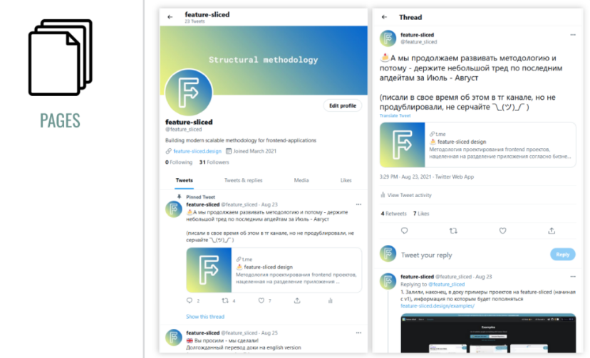
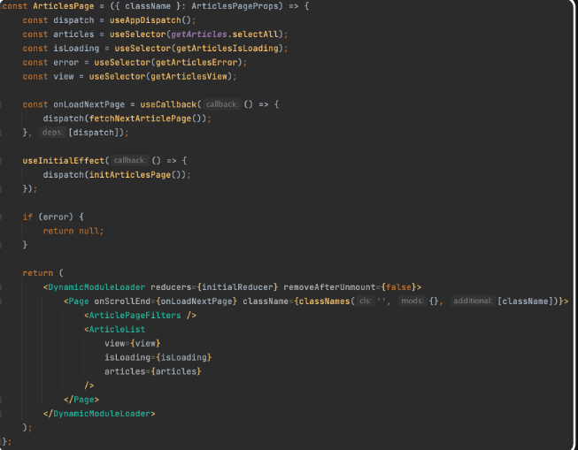

## Pages

Pages — также композиционный слой. Он нужен, чтобы собирать из виджетов, сущностей и фичей полноценные страницы приложения. Главное правило для страниц — они должны быть максимально «тонкими», не содержать дополнительную бизнес-логику. Весь код мы должны реализовать на слоях ниже.

Пример из пет-проекта. В идеальной ситуации здесь были бы только импорты, но у меня есть ещё немного лишней логики

