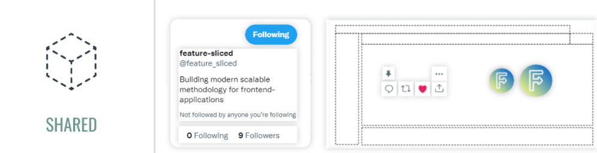
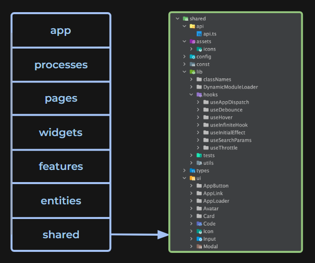

# Shared

Самый абстрактный слой приложения, который содержит переиспользуемые модули, не связанные с бизнес-логикой. Этот слой хорошо подходит для начала применения FSD. В наших проектах эта директория делится на несколько сегментов, некоторых из которых нет в FSD:

- **shared/api**: работа с API.
- **shared/config**: модуль конфигурации приложения и его окружения.
- **shared/hooks**: кастомные хуки.
- **shared/lib**: различные утилитарные функции и вспомогательные библиотеки.
- **shared/themes**: список цветов и тем приложения.
- **shared/ui**: UI-компоненты: Input, Select, Table и другие.

Самое главное — не путать абстрактные UI-компоненты с компонентами, реализующими конкретные бизнес-сущности или фичи. К примеру, Select — это Shared/UI-компонент, а CitySelect — уже фича. При создании того или иного модуля нужно оценить, будут ли использоваться бизнес-сущности в компоненте. Если нет — модуль необходимо назвать максимально абстрактно и поместить в Shared. В противном случае, желательно указать в названии бизнес-сущность или фичу, которую модуль реализует, и поместить в слой Entities или Features. От грамотного нейминга в этой методологии зависит очень многое.

Как пример структуры вот:

