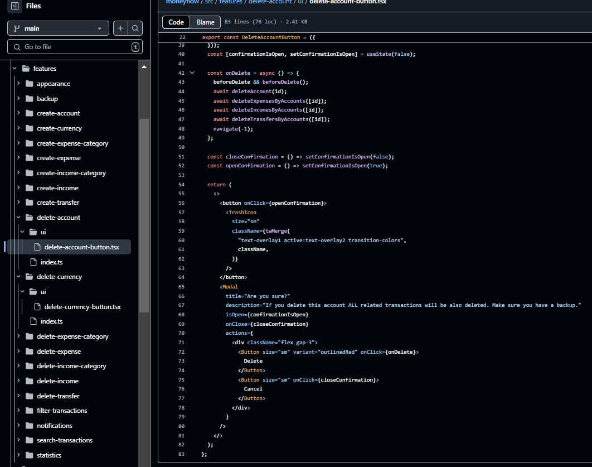
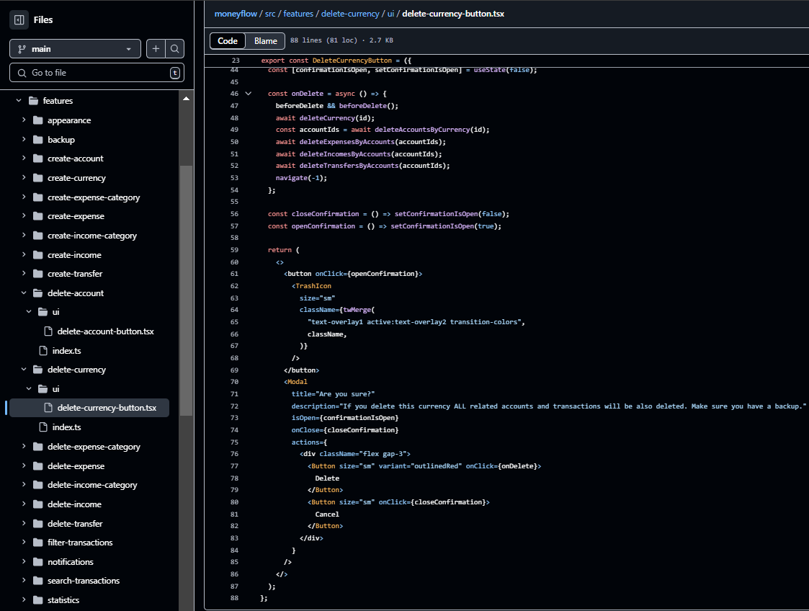
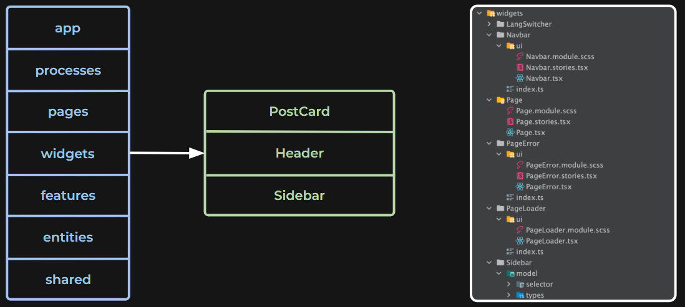
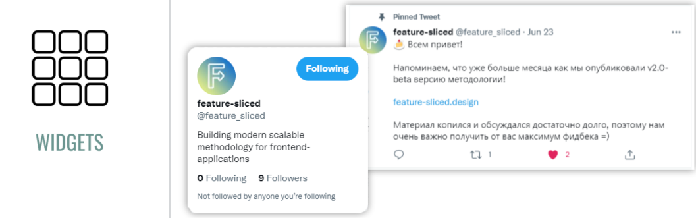

## Предисловие

Поскольку мы дошли до слоя с виджетами, но пропустили слой features, стоит пояснить причину этого решения.

Учитывая специфику данного проекта, а также проведенные исследования схожих репозиториев, реализующих методологию архитектуры FSD, было принято решение не выделять слой features. Это объясняется тем, что в рамках текущего проекта бизнес-логика и функциональные модули могут быть успешно реализованы через бизнес-сущности и виджеты без необходимости в дополнительном уровне абстракции.

### Проблемы при реализации архитектуры с избыточными абстракциями и компонентами

1. **Избыточная абстракция и сложность структуры**  
   - Добавление дополнительного слоя абстракций, например, через компоненты, создает новые узлы в дереве.  
   - Вместо того чтобы сосредоточить бизнес-логику непосредственно в виджетах, как того требует архитектура, структура усложняется, превращаясь в «муравейник».  
   - Это приводит к избыточным связям и усложнению управления, что затрудняет поддержание кода.

2. **Проблемы с производительностью и взаимодействием компонентов**  
   - Увеличение количества абстракций и компонентов повышает сложность взаимодействий между ними.  
   - Это может привести к значительным накладным расходам на рендеринг, обновление состояния и управление зависимостями.  
   - В крупных проектах взаимодействие множества компонентов может замедлить работу приложения и усложнить отладку.

3. **Сложности с изменением бизнес-логики**  
   - Разделение бизнес-логики на множество слоев и компонентов усложняет внесение изменений.  
   - Каждое изменение требует затрагивания множества взаимосвязанных элементов, что снижает гибкость системы и увеличивает сложность поддержки приложения.

4. **Трудности с тестированием и отладкой**  
   - С увеличением количества абстракций становится сложнее проводить изолированное тестирование компонентов.  
   - Сложности во взаимодействии компонентов затрудняют интеграционное тестирование и поиск неожиданных ошибок.

5. **Проблемы с повторным использованием компонентов**  
   - Когда компоненты или абстракции сильно связаны с конкретной областью или проектом, их повторное использование в других частях системы становится трудным.  
   - Это приводит к дублированию кода, усложняет архитектуру и нарушает принципы модульности, что делает систему менее гибкой и удобной для изменений.

|  |  |
|-------------------------------------------------|-------------------------------------------------|

## Widgets

Widgets — слой, который связывает сущности и фичи. Он помогает собрать готовый смысловой блок из разных элементов.

Виджеты позволяют расширять функциональность сущности. Например, пост в сообществе и пост на странице пользователя в социальной сети выглядят одинаково. При этом кнопки лайка на них выполняют немного разные функции. На странице пользователя кнопка отправляет уведомление конкретному человеку, а в сообществе — всем пользователям.

